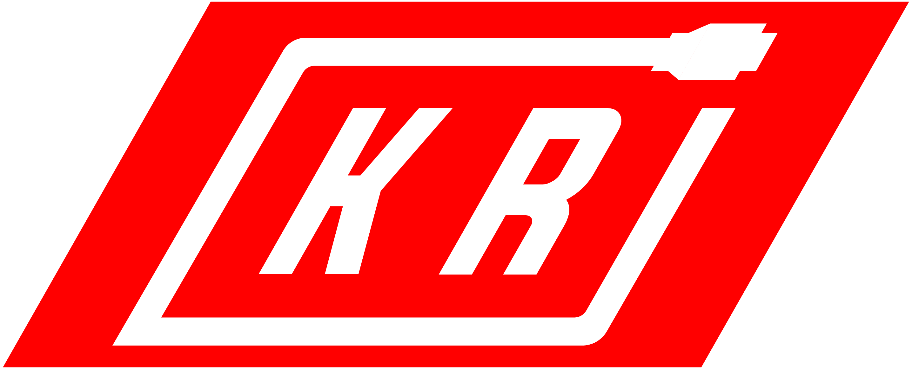
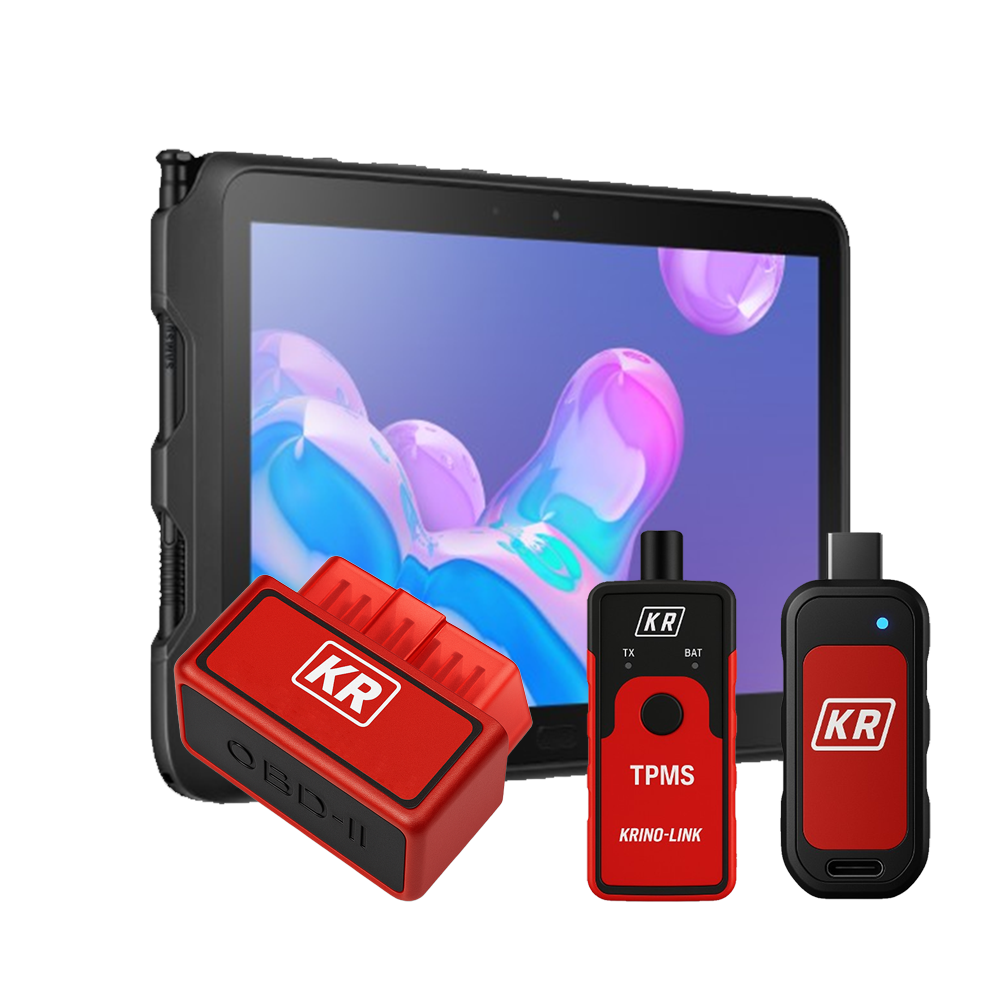
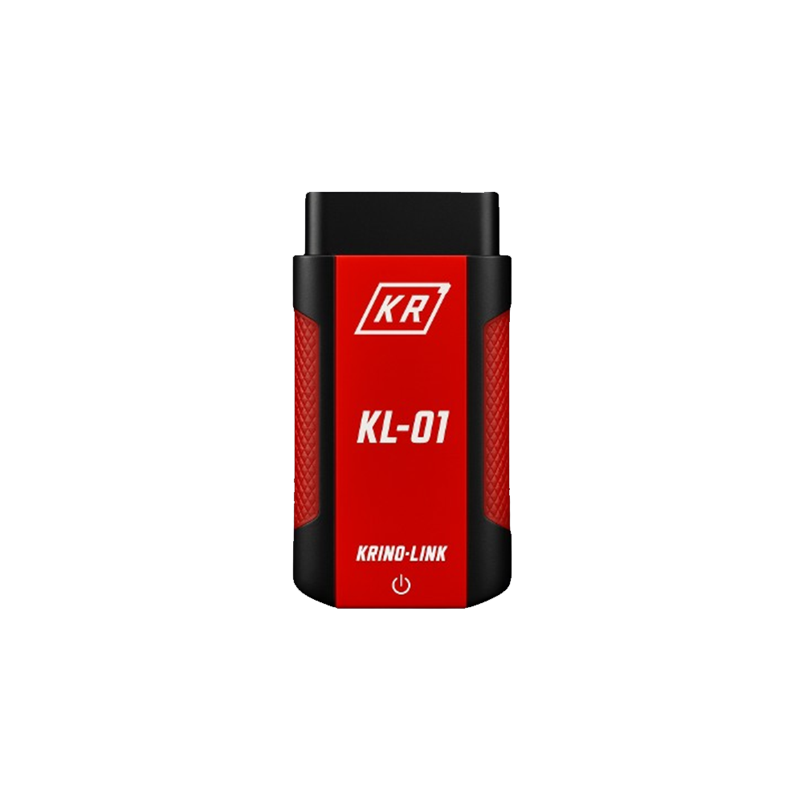

<p align="center">
  
</p>

<h1 align="center" style="color:#c3151b;">Krino-Link</h1>
<p align="center">
  <b>Plataforma avanzada de diagnóstico OBD2 para vehículos eléctricos e híbridos</b>
</p>
<p align="center">
  <a href="https://nextjs.org/"></a>
  <a href="https://tailwindcss.com/"></a>
  <a href="https://vercel.com/"></a>
</p>

---

## 🚗 ¿Qué es Krino-Link?

**Krino-Link** es una plataforma moderna para talleres y técnicos automotrices, enfocada en el diagnóstico, simulación y venta de equipos OBD2 para vehículos eléctricos e híbridos. Incluye simuladores interactivos, tienda especializada, soporte técnico y módulos de análisis avanzados.

---

## 📸 Vista previa

<p align="center">
  
  
</p>

---

## 📋 Tabla de Contenidos

- [Características](#características)
- [Instalación](#instalación)
- [Estructura del Proyecto](#estructura-del-proyecto)
- [Módulos Principales](#módulos-principales)
- [Personalización](#personalización)
- [Contribuir](#contribuir)
- [Licencia](#licencia)

---

## ✨ Características

- **Diagnóstico OBD2 avanzado** para eléctricos e híbridos
- **Simulador web** para pruebas y capacitación
- **Tienda de dispositivos** con carrito y filtros
- **Asistente IA** para interpretación de códigos DTC
- **Actualizaciones OTA** y soporte técnico
- **Interfaz moderna** con TailwindCSS y Lucide Icons

---

## 🚀 Instalación

```bash
git clone https://github.com/tuusuario/krino-link.git
cd krino-link
npm install
npm run dev
```

Abre [http://localhost:3000](http://localhost:3000) en tu navegador.

---

## 🗂️ Estructura del Proyecto

```
/app
  /AnalisisBateria
  /AnalisisMotor
  /AnalisisRapido
  /AsistenteIA
  /DeviceSelector
  /MenuDiagnostico
  /Simulador
  /Tienda
/components
/public/images
```

---

## 🧩 Módulos Principales

- **LandingPage:** Página principal con CTA y testimonios.
- **Tienda:** Catálogo de productos, filtros, carrito y detalles.
- **Simulador:** Diagnóstico virtual de sistemas eléctricos y de batería.
- **MenuDiagnostico:** Acceso rápido a análisis de motor, batería, IA, etc.
- **AsistenteIA:** Chat para interpretación de códigos DTC.
- **Actualizaciones:** Gestión de firmware y app.

---

## 🎨 Personalización

- **Colores:** Basado en la paleta `#c3151b` (rojo), `#facc15` (amarillo), y fondos oscuros.
- **Fuentes:** [Geist](https://vercel.com/font) integrada vía `next/font`.
- **Imágenes:** Todos los productos en `/public/images/store/`.

---

## 🤝 Contribuir

¿Quieres mejorar Krino-Link? ¡Pull requests y sugerencias son bienvenidas!

1. Haz un fork del repositorio
2. Crea una rama (`git checkout -b feature/nueva-funcion`)
3. Haz tus cambios y commitea (`git commit -am 'Agrega nueva función'`)
4. Haz push a la rama (`git push origin feature/nueva-funcion`)
5. Abre un Pull Request

---

## 📄 Licencia

Este proyecto está bajo la licencia MIT.

---

<p align="center">
  <b>Krino-Link &copy; {new Date().getFullYear()} | Todos los derechos reservados</b>
</p>
